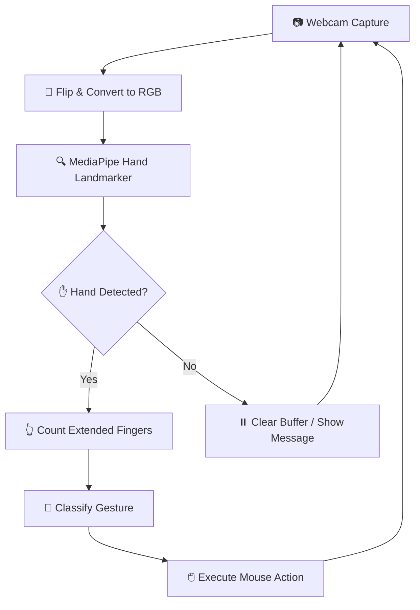

<div align="center">
  
# 🖱️ **Easy Virtual Mouse**  
### *Control Your Computer with Finger Gestures!* ✨

[](https://python.org)
[](https://mediapipe.dev)
[](https://opencv.org)
[](LICENSE)

---

> **Turn your webcam into a mouse!** 👋  
> Wave your hand, move your cursor. No physical touch required.

[🎥 Demo](#-demo) •
[🚀 Features](#-features) •
[📋 How It Works](#-how-it-works) •
[⚙️ Installation](#️-installation) •
[🖐️ Gesture Guide](#️-gesture-guide) •
[🧠 Project Structure](#-project-structure)

---

</div>

## 🌟 **Overview**

**Easy Virtual Mouse** is a Python-based **Hand Gesture Recognition** system that lets you control your computer mouse using nothing but your **webcam** and **hand movements**. Powered by **MediaPipe** for real-time hand tracking and **OpenCV** for image processing, it detects finger positions and translates them into mouse actions.

## 🎬 **Demo**

```
┌─────────────────────────────────────────────┐
│  🎥 Webcam Feed Window                       │
│                                             │
│    ✋ All 5 fingers → Move Mouse             │
│    👆 Index only    → Left Click             │
│    ✌️ Index+Middle  → Right Click            │
│    🤟 Three fingers → Double Click           │
│    ✊ Fist           → Screenshot            │
│                                             │
│         [ Press 'q' to quit ]               │
└─────────────────────────────────────────────┘
```

## 🚀 **Features**

| Feature | Description |
|---------|-------------|
| 🎯 **Real-Time Tracking** | ~30 FPS hand landmark detection via webcam |
| ✨ **Smooth Mouse Movement** | Averaged cursor position with buffer smoothing |
| 🖱️ **Click Gestures** | Left, Right, and Double-click support |
| 📸 **Screenshot Capture** | Fist gesture saves screen captures automatically |
| 🎨 **Visual Feedback** | On-screen gesture labels with colored text |
| 🔄 **Gesture Cooldown** | Prevents accidental repeated triggers |
| 🖐️ **Hand Skeleton Overlay** | Green connection lines drawn on detected hand |

## 📋 **How It Works**



### **Pipeline Stages**

1. **Capture** – Frames are read from your webcam via OpenCV
2. **Detect** – MediaPipe's `HandLandmarker` identifies 21 hand landmarks
3. **Count** – Finger extension is determined by comparing landmark Y/X coordinates
4. **Classify** – The finger-count pattern maps to a specific gesture name
5. **Execute** – The gesture triggers the appropriate mouse action

## ⚙️ **Installation**

### ✅ **Prerequisites**

- Python **3.8+**
- A working **webcam**
- Windows / macOS / Linux

### 📦 **Setup Steps**

```bash
# 1️⃣ Clone the repository
git clone https://github.com/binusha12345/Virtual-Mouse.git
cd "Finger Guesture Using Python"

# 2️⃣ (Optional) Create a virtual environment
python -m venv venv
# Windows:
venv\Scripts\activate
# macOS/Linux:
source venv/bin/activate

# 3️⃣ Install dependencies
pip install -r requirements.txt
```

If you don't have `requirements.txt`, install manually:

```bash
pip install opencv-python mediapipe pyautogui pynput numpy
```

### 📁 **Required Files**

| File | Purpose |
|------|---------|
| `camera.py` | Main application entry point |
| `util.py` | Helper functions (angle & distance) |
| `hand_landmarker.task` | MediaPipe pre-trained model |
| `README.md` | This documentation |

## 🖐️ **Gesture Guide**

<div align="center">

| Gesture | Fingers Up | Action | Icon |
|:-------:|:----------:|:------:|:----:|
| **Move** | 5 (Open Palm) | 🖱️ Move Cursor | ✋ |
| **Left Click** | 1 (Index) | 👆 Single Click | ☝️ |
| **Right Click** | 2 (Index + Middle) | ✌️ Context Menu | ✌️ |
| **Double Click** | 3 (Index + Middle + Ring) | 🤟 Quick Select | 🤟 |
| **Screenshot** | 0 (Fist) | 📸 Capture Screen | ✊ |

</div>

### **💡 Tips for Best Performance**

> - 🏠 Ensure **good lighting** – avoid strong backlight
> - 📏 Keep your hand **1-2 feet** from the camera
> - 🎨 Use a **plain background** for better detection
> - 🕐 Pause briefly between gestures (cooldown helps)
> - ✋ Hold each gesture steady for ~0.5 seconds

## 🧠 **Project Structure**

```
📁 Finger Gesture Using Python
├── 🐍 camera.py               # Main app — hand tracking & gesture execution
├── 🐍 util.py                 # Utility — angle & distance calculations
├── 🧠 hand_landmarker.task    # MediaPipe pre-trained model (21 landmarks)
├── 📖 README.md               # You are here!
└── 📸 screenshot_*.png        # Captured screenshots (auto-generated)
```

## 🧩 **Key Code Breakdown**

### 🔹 **Finger Counting Logic** (`camera.py`)

```
┌──────────────────────────────────────────────────┐
│  count_fingers(hand_landmarks)                   │
│  ├── Thumb  → Compare x of tip vs PIP            │
│  ├── Index  → Compare y of tip(8)  vs PIP(6)     │
│  ├── Middle → Compare y of tip(12) vs PIP(10)    │
│  ├── Ring   → Compare y of tip(16) vs PIP(14)    │
│  └── Pinky  → Compare y of tip(20) vs PIP(18)    │
└──────────────────────────────────────────────────┘
```

### 🔹 **Gesture Mapping** (`camera.py`)

| Finger State (List) | Gesture Name | Action |
|:-------------------:|:------------:|:------:|
| `[1,1,1,1,1]` | `"MOVE"` | Smooth cursor tracking |
| `[0,1,0,0,0]` | `"LEFT_CLICK"` | `mouse.click(Button.left)` |
| `[0,1,1,0,0]` | `"RIGHT_CLICK"` | `mouse.click(Button.right)` |
| `[0,1,1,1,0]` | `"DOUBLE_CLICK"` | `pyautogui.doubleClick()` |
| `[0,0,0,0,0]` | `"SCREENSHOT"` | `pyautogui.screenshot()` |

### 🔹 **Utility Functions** (`util.py`)

- **`get_angle(a, b, c)`** – Calculates the angle between three landmarks (useful for custom gesture detection)
- **`get_distance(landmark_list)`** – Computes the Euclidean distance between two landmarks, normalized to 0–1000

## ▶️ **How to Run**

```bash
python camera.py
```

Press the **`q`** key while the webcam window is active to quit.

You'll see the startup menu:
```
==================================================
🖱️  EASY VIRTUAL MOUSE - FINGER COUNTING
==================================================
✋ 5 Fingers UP      → Move Mouse
👆 Only Index UP     → Left Click
✌️  Index + Middle   → Right Click
🤟 Three Fingers UP  → Double Click
✊ Closed Fist       → Screenshot
==================================================
Press 'q' to quit
```

## 🧪 **Alternative Gesture Methods**

The code includes commented-out ideas for other gesture schemes you can experiment with:

<details>
<summary><b>📂 Click to expand alternative methods</b></summary>

### **Method 2: Thumb-Based Control**

```
👍 THUMB UP              → Move Mouse
👎 THUMB DOWN            → Left Click
👍 + ✌️ (Thumb + Peace)  → Right Click
✊ FIST                  → Screenshot
```

### **Method 3: Single Hand Palm Control**

```
🖐️ OPEN PALM (5 fingers) → Move Mouse
👊 FIST (0 fingers)      → Left Click
✌️ PEACE (2 fingers)     → Right Click
🤘 ROCK (2 different)    → Screenshot
```

</details>

## 🛠️ **Troubleshooting**

| Problem | Solution |
|---------|----------|
| 🎥 No webcam detected | Check camera permissions & USB connection |
| 🐌 Low FPS | Reduce camera resolution in `cap.set()` |
| ✋ Hand not detected | Improve lighting & avoid complex backgrounds |
| 🔄 Gesture not triggering | Hold gesture steady for cooldown period |
| 🖱️ Cursor jumps | Move hand slower for smoother tracking |

## 📚 **Dependencies**

| Package | Version | Purpose |
|---------|:-------:|---------|
| `opencv-python` | latest | Webcam capture & image processing |
| `mediapipe` | latest | Hand landmark detection (21 points) |
| `pyautogui` | latest | Mouse movement & screenshot |
| `pynput` | latest | Advanced mouse button control |
| `numpy` | latest | Mathematical calculations |

## 🤝 **Contributing**

Contributions are welcome! Feel free to:

1. 🍴 Fork the repository
2. 🌿 Create a feature branch (`git checkout -b feature/amazing-idea`)
3. 💾 Commit changes (`git commit -m 'Add amazing feature'`)
4. 🚀 Push to branch (`git push origin feature/amazing-idea`)
5. 🔃 Open a Pull Request

## 📄 **License**

This project is licensed under the **MIT License** – see the [LICENSE](LICENSE) file for details.

---

<div align="center">

### ⭐ **If you like this project, give it a star!** ⭐

[](https://github.com/binusha12345/Virtual-Mouse)

**Made with ❤️ and Python**

</div>